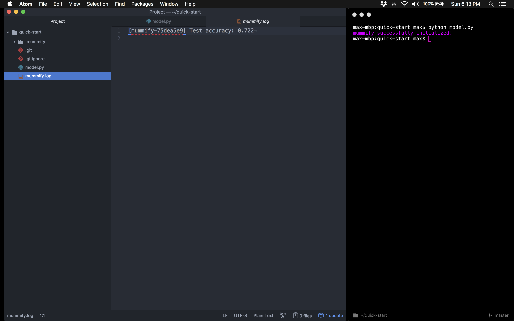
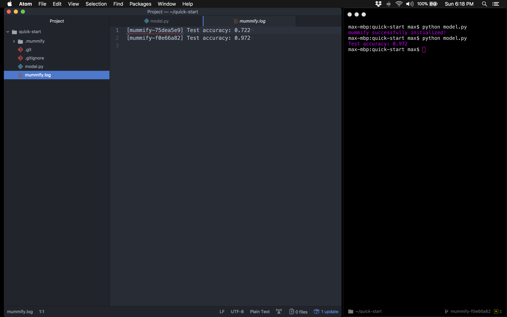
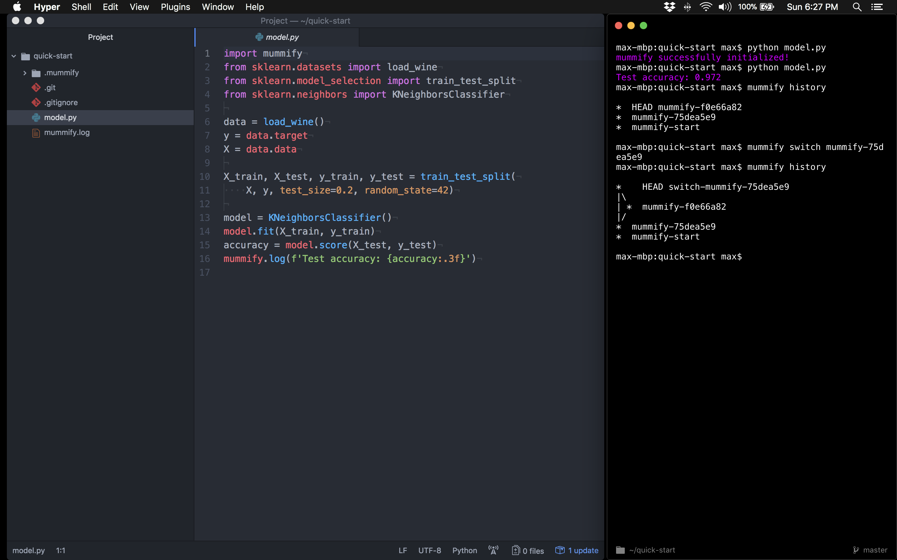

# mummify

---


---

## Install

`pip install mummify`

---

## About

*"You suck at Git. And logging. But it's not your fault."*

mummify is git+logging for people who do machine learning.

mummify is simple, opinionated, and built directly on top of git.

mummify comes packaged with three main functions:

- `log` to automatically log and commit
- `history` to view the commit graph tree
- `switch` to switch to a different commit

---

## Quick Start

Import `mummify` at the top of your machine learning script (in this case, `model.py`) and add `mummify.log(<message>)` at the very end of your script:

```
import mummify
from sklearn.datasets import load_wine
from sklearn.model_selection import train_test_split
from sklearn.neighbors import KNeighborsClassifier

data = load_wine()
y = data.target
X = data.data

X_train, X_test, y_train, y_test = train_test_split(
    X, y, test_size=0.2, random_state=42)

model = KNeighborsClassifier()
model.fit(X_train, y_train)
accuracy = model.score(X_test, y_test)
mummify.log(f'Test accuracy: {accuracy:.3f}')
```

When you call `python model.py` from the command line mummify will initialize a specialized `.mummify` git directory, create a `mummify.log` file, and keep track of model performance:



Whenever you make a change to your model, think: swap in a new algorithm:

```
import mummify
from sklearn.datasets import load_wine
from sklearn.model_selection import train_test_split
from sklearn.linear_model import LogisticRegression

data = load_wine()
y = data.target
X = data.data

X_train, X_test, y_train, y_test = train_test_split(
    X, y, test_size=0.2, random_state=42)

model = LogisticRegression()
model.fit(X_train, y_train)
accuracy = model.score(X_test, y_test)
mummify.log(f'Test accuracy: {accuracy:.3f}')
```

And re-run `python model.py` mummify will update the `mummify.log` file and save the state of your model:



To view the mummify log history from the command line you can run `mummify history`:

```
max-mbp:quick-start max$ mummify history

*  HEAD mummify-f0e66a82
*  mummify-75dea5e9
*  mummify-start

max-mbp:quick-start max$
```

And to rewind history (go back to a previous state), just grab the mummify identifier that you want to switch to from the `mummify.log` file and run `mummify switch <id>` from the command line:



mummify will preserve all state history on a switch and keep the `mummify.log` file immutable.
